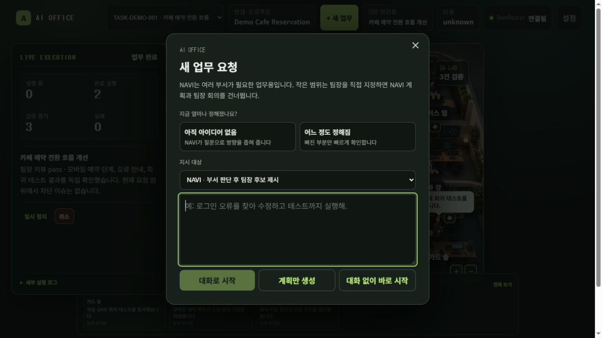
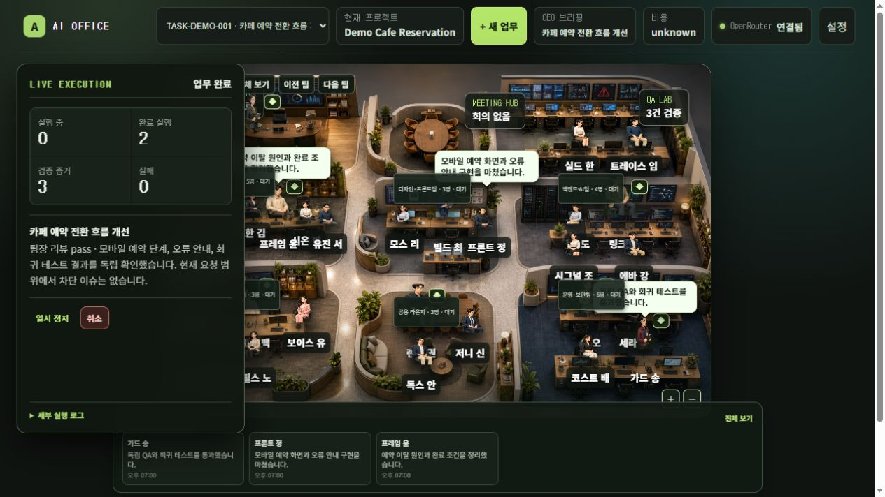
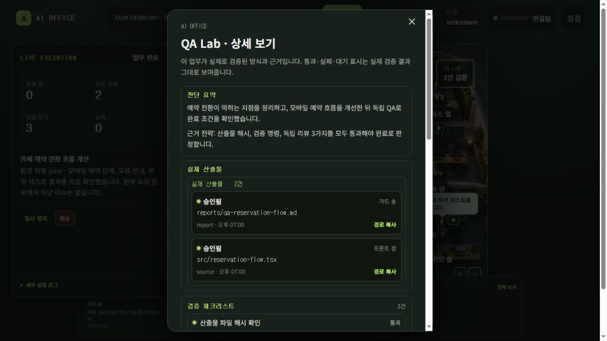

# AI Office

> ## 게임처럼 보이지만, 실제로 일하는 AI 조직.
>
> 목표 하나를 받으면 역할 기반 AI 조직이 기획·구현·검증을 이어 가고, 사용자는 중요한 결정과 Evidence만 확인하는 로컬 멀티 에이전트 운영 시스템입니다.

[](https://www.python.org/)
[](https://fastapi.tiangolo.com/)
[](https://react.dev/)
[](https://www.typescriptlang.org/)
[](https://www.sqlite.org/)

<p align="center">
  <a href="#3분-안에-내-프로젝트-맡기기"><strong>로컬에서 실행하기</strong></a> ·
  <a href="#핵심-구현과-기여"><strong>구현 기여 보기</strong></a> ·
  <a href="#검증한-범위와-한계"><strong>검증 범위 보기</strong></a> ·
  <a href="#ai-office가-일하는-방식"><strong>서비스 서사 보기</strong></a>
</p>

## 먼저 보기

아래는 **외부 모델 호출·사용자 프로젝트·개인 데이터 없이** 만든 `카페 예약 전환 흐름 개선` 가상 시나리오입니다. UI를 꾸미기 위한 정적 목업이 아니라, 분리 SQLite fixture를 실제 API에 연결해 Task·Job·Evidence 상태를 렌더링한 화면입니다.

| 업무 접수 | 조직 운영 화면 | Evidence 확인 |
|---|---|---|
|  |  |  |

## 프로젝트 한눈에

| 항목 | 내용 |
|---|---|
| 해결할 문제 | 여러 AI에 역할·맥락·검수를 반복 지시해야 하는 작업 흐름 |
| 핵심 경험 | 목표 전달 → 팀 구성 → workspace 실행 → 독립 리뷰 → Evidence 기반 완료 |
| 대상 사용자 | 비개발 창업가, PM, 1인 개발자, 소규모 제품팀 |
| 실행 환경 | Windows 로컬 단일 사용자 · OpenRouter API key 선택 설정 |
| 직접 체험 | [설치·실행 방법](#3분-안에-내-프로젝트-맡기기)으로 자신의 로컬 프로젝트 연결 |

## 핵심 구현과 기여

개인 프로젝트로 서비스 기획부터 실행 구조와 UI까지 설계·구현했습니다.

- **제품 설계**: 채팅형 AI 도구가 아니라 역할·전문 스킬·인계 순서·검증 기준을 가진 “작은 회사”를 제품 모델로 정의했습니다.
- **멀티 에이전트 실행기**: FastAPI API, SQLite WAL, worker lease·heartbeat, retry·checkpoint로 장시간 Job 상태를 복구 가능하게 만들었습니다.
- **통제 가능한 자동화**: 요청별 `TaskContract`로 허용 경로·명령·권한을 제한하고, 민감 권한은 승인 대기로 멈춥니다.
- **검증 중심 완료 판정**: 산출물 hash, 검증 명령, 독립 리뷰가 모두 통과해야 완료 상태에 도달하게 했습니다.
- **오피스형 운영 UI**: React/TypeScript 화면에서 Task와 Job event를 부서·회의·QA Lab·직원 이동으로 대응시켜, 누가 무엇을 책임지는지 읽을 수 있게 했습니다.

### 어려웠던 문제와 해결 방식

| 문제 | 해결 | 코드상 근거 |
|---|---|---|
| 모델 호출보다 오래 사는 Job을 어떻게 신뢰할까 | SQLite WAL과 atomic lease, worker heartbeat, interrupted 복구, checkpoint·retry를 분리 설계 | [Durable Runtime](docs/RUNTIME_HARDENING.md) |
| AI의 “완료”를 말이 아닌 결과로 판정하려면 | 파일 hash·검증 명령 종료 코드·독립 리뷰를 Evidence gate로 묶고, 하나라도 빠지면 완료를 차단 | [Evidence UI](apps/web/src/shared.tsx) · [Task routes](apps/api/task_routes.py) |
| 보이지 않는 에이전트 작업을 어떻게 통제 화면으로 만들까 | 실제 Task state·Job event·담당자 정보를 오피스 구역, 회의실, QA Lab, 실행 타임라인에 연결 | [App](apps/web/src/App.tsx) · [Office floor](apps/web/src/OfficeFloor.tsx) |

## 검증한 범위와 한계

**로컬에서 확인한 범위**

- Python `unittest` 88개, Vitest 11개, TypeScript/Vite production build
- 24명·8개 부서 routing 일관성, 스킬·패키지 audit
- API와 worker build ID가 다르거나 worker heartbeat가 사라지면 실행을 막는 runtime guard
- README 화면은 분리 fixture로 재현: 실제 사용자 프로젝트·API key·모델 출력 미사용

**아직 검증하지 않은 범위**

- 공개 SaaS 배포, 멀티테넌트·동시 사용자, 운영 환경 관측성
- 다양한 실제 프로젝트에서의 모델 품질·비용·완료율에 대한 정량 평가
- 승인 없는 외부 전송·게시·배포 자동화

따라서 이 저장소는 “배포된 AI SaaS”가 아니라, 로컬 환경에서 실행·검증 가능한 **멀티 에이전트 운영 시스템 프로토타입**으로 평가해야 합니다.

## AI를 쓰고 있는데, 왜 아직도 내가 팀장일까?

AI 도구는 많아졌습니다. 하지만 아이디어 하나를 제품으로 만들려면 여전히 사람이 해야 할 일이 너무 많습니다.

- 기획 AI에게 맥락을 다시 설명하고
- 디자인 AI에게 같은 요구사항을 다시 전달하고
- 개발 AI에게 결과물을 넘기고
- 빠진 부분을 찾아 다시 지시하고
- 결과가 정말 맞는지 직접 검수합니다

AI가 일을 돕고 있어도, 결국 사람은 여러 AI를 연결하는 프로젝트 매니저로 남습니다.

**AI Office는 이 역할을 바꾸기 위해 만들었습니다.**

AI를 더 많이 호출하는 도구가 아니라, 역할·전문성·협업 순서·검증 기준을 갖춘 **작은 회사 자체를 제품으로** 만듭니다. 사용자는 업무 목표를 전달하고, AI 조직은 필요한 사람을 모아 실제 결과물까지 책임집니다.

| 이전 | AI Office 이후 |
|---|---|
| 여러 AI에게 역할과 맥락을 반복해서 설명 | 목표를 전달하면 필요한 부서와 전문가가 협업 |
| 결과를 사람이 직접 이어 붙이고 관리 | 업무 흐름과 책임자가 조직 안에서 연결 |
| “완료했다”는 답변을 믿고 다시 확인 | 파일, 검증 결과, 리뷰를 기준으로 완료 판정 |
| 보이지 않는 AI 작업을 기다림 | 사무실·회의·업무 이동으로 진행 상태를 확인 |

## 누구를 위한 오피스인가

개발 조직을 따로 꾸리기 어려운 사람을 위한 제품입니다.

- 아이디어는 있지만 기획·디자인·개발·검수를 혼자 끌고 가는 창업가
- 제품 전체 흐름을 책임져야 하는 PM
- 혼자 만들고, 혼자 검수하고, 혼자 다음 일을 정하는 1인 개발자
- 작은 팀인데 여러 AI 도구를 연결하는 일이 또 하나의 업무가 된 팀

AI Office는 사람을 의사결정에서 빼지 않습니다. 대신 반복 지시와 조율에서 빼냅니다. 목표, 우선순위, 승인 같은 중요한 결정은 사람이 맡고, 조사·설계·구현·검수는 조직이 맡습니다.

## AI Office가 일하는 방식

```text
목표 전달
  │
  ▼
NAVI가 요청을 정리하고 필요한 팀장과 작업 범위를 제안
  │
  ▼
팀장이 회의하고, 자기 부서의 전문가를 배정
  │
  ▼
전문가가 실제 workspace에서 조사·기획·구현·검증
  │
  ▼
독립 리뷰와 Evidence 확인
  │
  ├─ 보완 필요: 담당 조직으로 돌아가 수정·재검증
  └─ 통과: 최종 산출물과 결과 보고
```

### 8개 부서, 24명의 역할 기반 직원

AI Office의 직원은 이름만 다른 캐릭터가 아닙니다. 각 직원은 소유 업무, 권한, 필수 스킬, 평가 기준을 갖고 요청에 따라 호출됩니다.

| 부서 | 팀장 | 하는 일 |
|---|---|---|
| Operations & Planning | NAVI | 요청 정리, 계약, 라우팅, 일정 |
| Product Experience | FRAME | 문제 정의, PRD, UX/UI, 수용 기준 |
| Application | BUILD | 기술 설계, 프론트엔드·백엔드 구현 |
| AI & Data | LINK | AI 구조, 검색·데이터 파이프라인, 평가 |
| Platform & Reliability | SHIP | 릴리스, CI/CD, 관측성, 비용 |
| Quality & Security | GUARD | 독립 시험, 보안, Evidence gate |
| Growth & Marketing | GROW | 시장·고객 조사, 포지셔닝, 카피, 실험 |
| Service & Knowledge | LENS | 사용자 여정, 문서화, 지식 패키지 |

누가 무엇을 할지는 고정된 업무표가 결정하지 않습니다. 부서의 책임 범위, 현재 가능한 인력, 필요한 스킬을 함께 보고 요청마다 팀을 구성합니다.

### 스킬이 있는 직원은 다르게 일합니다

에이전트에게 “너는 마케터야”라고 이름만 붙이지 않습니다. 직원마다 전문 지침과 작업 방식을 연결합니다.

- 일정한 작업 기준으로 기획·개발·검수
- 긴 프롬프트를 매번 다시 쓰지 않아도 되는 전문성
- 업무에 맞는 스킬 선택과 적용 기록
- 공용 스킬 풀을 설치·검증하고 필요에 따라 교체할 수 있는 구조

그래서 AI Office의 핵심은 AI 모델 하나가 아닙니다. **전문성을 가진 직원들이 어떤 순서로 함께 일하고, 결과를 어떻게 검증하는가**입니다.

## 왜 사무실이어야 하나

AI의 작업은 보통 보이지 않습니다. 채팅창의 답변 몇 줄만 보고 “지금 누가 무엇을 하고 있는지”, “어디서 멈췄는지”, “누가 결과에 책임지는지”를 이해하기 어렵습니다.

AI Office는 이 보이지 않는 작업을 사무실로 바꿉니다. 부서, 회의실, 업무 이동, 직원 아바타는 단순한 장식이 아닙니다. 실제 Task와 Job event를 읽어 현재 업무 흐름과 책임자를 보여주는 통제 화면입니다.


재미와 몰입감은 남기되, 의미 없는 캐릭터 구경이나 회의 시뮬레이션으로 끝내지 않습니다. 회의 발언, 도구 호출, 파일 변경, 검증 결과는 실제 실행 기록을 기준으로 표시됩니다.

## AI가 마음대로 일하는 제품은 아닙니다

AI 조직이 실제 파일과 명령을 다루려면, 자율성보다 통제가 먼저입니다.

| 약속 | 실제 동작 |
|---|---|
| 결과를 말로만 완료 처리하지 않음 | 파일 hash, 검증 명령, 독립 리뷰가 모두 있어야 `completed` |
| 권한을 넓게 주지 않음 | TaskContract가 요청별 허용 경로·명령·권한 규칙을 발급 |
| 중요한 결정은 사용자에게 남김 | `ask` 권한은 HTTP 428로 멈추고 승인 대기 |
| 작업이 사라지지 않음 | SQLite WAL, lease, heartbeat, checkpoint, retry |
| 실패를 숨기지 않음 | 실패한 검증, 리뷰 반려, worker 중단은 완료를 막음 |
| 위험한 행동을 자동 실행하지 않음 | 외부 전송, 배포, `git push` 등은 명시 권한 없이 실행하지 않음 |

“자율적으로 보이는 것”과 “안전하게 맡길 수 있는 것”은 다릅니다. AI Office는 후자를 목표로 합니다.

## 3분 안에 내 프로젝트 맡기기

### 준비물

| 항목 | 요구사항 |
|---|---|
| OS | Windows 10/11 |
| Python | 3.12 이상 |
| Node.js | 20.19 이상 또는 22.12 이상 + npm |
| ripgrep | `rg` 명령 사용 가능 상태 |
| 모델 API | OpenRouter API key |
| Git | 선택. Git 프로젝트면 branch/worktree 격리 사용 |

### 설치

저장소 루트에서 한 번 실행합니다.

```powershell
powershell.exe -ExecutionPolicy Bypass -File .\scripts\setup.ps1
```

이 스크립트는 Python/npm 의존성, 직원 스킬, 스킬 검증과 인덱스를 준비합니다.

### 실행

```powershell
powershell.exe -ExecutionPolicy Bypass -File .\scripts\start-ai-office.ps1
```

또는 `AI_Office_실행.cmd`를 실행합니다. 런처가 API, worker, UI를 같은 build로 실행하고 브라우저를 엽니다.

### 첫 업무

1. 설정 화면에서 OpenRouter API key를 저장합니다. key는 OS keyring에 저장됩니다.
2. 작업할 로컬 프로젝트를 등록합니다.
3. 목표를 자연어로 요청합니다. 예: `회원 가입 흐름을 점검하고, 문제를 수정한 뒤 회귀 테스트까지 해줘.`
4. 팀장 제안과 작업 범위를 확인합니다.
5. 사무실에서 진행 상황, Evidence, 최종 산출물을 확인합니다.

실행 중 실제 주소는 `.ai-office/runtime.json`에서 확인할 수 있습니다.

## 개발자를 위한 기술 설계

서비스의 약속은 UI가 아니라 실행 구조로 지킵니다.

```text
React + Vite UI
  │ REST + Server-Sent Events
FastAPI
  │ Job enqueue / state query
SQLite WAL
  │ atomic lease + heartbeat
Worker processes
  ├─ OpenRouter model calls
  ├─ workspace file tools
  ├─ ripgrep / Pyright / test discovery
  ├─ verification commands
  ├─ web research
  ├─ document rendering
  └─ configured MCP tools
```

### 실행을 믿을 수 있게 만드는 장치

- Task 상태와 Job 상태를 분리해 업무 진행과 실행기 실패를 구분
- worker가 멈추면 lease·heartbeat로 감지하고 `interrupted`로 복구
- 재시도 때 성공한 `agent_run`은 건너뛰고 실패 단계부터 재개
- 프로젝트별 workspace 또는 Git worktree로 작업 격리
- 독립 리뷰 통과 뒤에만 변경을 통합
- API build, worker build, schema version이 다르면 실행 차단
- 조사 결과는 서로 다른 domain의 원문으로 검증
- DOCX/PDF/XLSX/PPTX/HWPX 산출물을 생성한 뒤 재파싱

상세 설계: [Architecture](docs/ARCHITECTURE.md) · [Durable Runtime](docs/RUNTIME_HARDENING.md)

## 검증

현재 저장소에서 직접 실행한 검증 결과입니다.

| 검증 | 결과 |
|---|---|
| Python unittest | 88/88 passed |
| Vitest | 11/11 passed |
| TypeScript + Vite production build | passed |
| Routing consistency | 24 employees · 8 departments · 0 static profiles · 16 standards |
| Skill/package audit | passed |

```powershell
# Backend
.\.venv\Scripts\python.exe -m unittest discover -s apps\api -p "test_*.py"

# Registry, skill, package consistency
.\.venv\Scripts\python.exe scripts\verify_routing.py
.\.venv\Scripts\python.exe scripts\verify_skills.py --employee ALL
.\.venv\Scripts\python.exe scripts\audit_package.py

# Frontend
cd apps\web
npm.cmd test -- --run
npm.cmd run build
```

테스트는 runtime 회귀를 검증합니다. 모델 응답은 mock하므로 산출물 품질은 실제 API 실행과 별도 평가가 필요합니다.

## 현재 범위와 다음 목표

AI Office는 현재 로컬 단일 사용자 환경을 전제로 합니다. 멀티테넌트 SaaS, 승인 없는 외부 전송·게시, 운영 환경 자동 배포, 무제한 자율 실행은 지원하지 않습니다.

다음 목표는 아이디어를 **기획 → 디자인 → 기술 설계 → 개발 → QA → 출고**로 이어, 다른 coding agent도 바로 이어받을 수 있는 프로젝트 폴더를 만드는 것입니다. 그 다음에는 한 대화창에서 목표를 전달하면 오피스가 접수·계획·실행·검증을 이어 가는 경험을 완성합니다.

- [Runtime roadmap](docs/RUNTIME_ROADMAP.md)
- [제품 목표 명세](reference/product-context/)
- [대화형 지시 목표](reference/legacy/CONVERSATIONAL_AGENT_TARGET.md)

## 문서와 보안

- [문서 지도](docs/README.md)
- [Contributing](CONTRIBUTING.md)
- [Security Policy](SECURITY.md)
- [Third-party notice](NOTICE.md)

API key는 OS keyring에만 저장합니다. 이 프로젝트는 로컬 단일 사용자 실행을 전제로 하며, 외부 네트워크에 API나 Vite dev server를 공개하는 배포는 지원하지 않습니다.

## 라이선스

저장소 라이선스는 아직 결정되지 않았습니다. 외부 스킬과 자산은 각 원저작자의 라이선스를 따릅니다. 배포·상업 이용 전 [NOTICE.md](NOTICE.md)와 [Source License Matrix](reference/corporate-os/07-SOURCE_LICENSE_MATRIX_v6.2.md)를 검토하세요.

---

<p align="center">
  <strong>AI를 더 많이 쓰는 법이 아니라, AI가 제대로 일하는 조직을 만듭니다.</strong>
</p>
